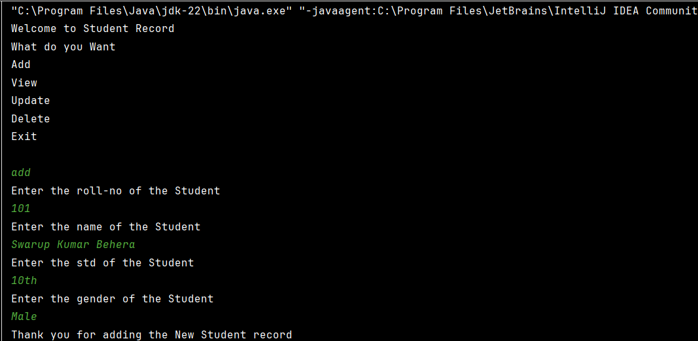
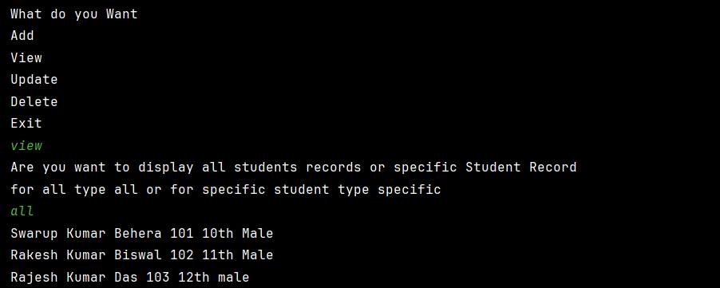
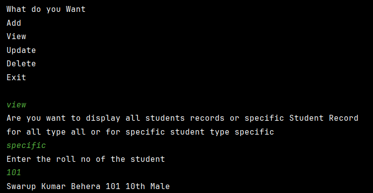
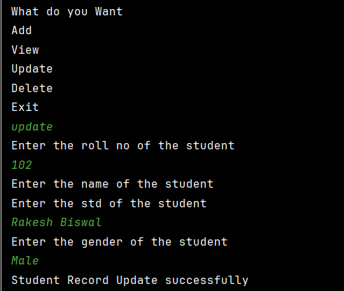
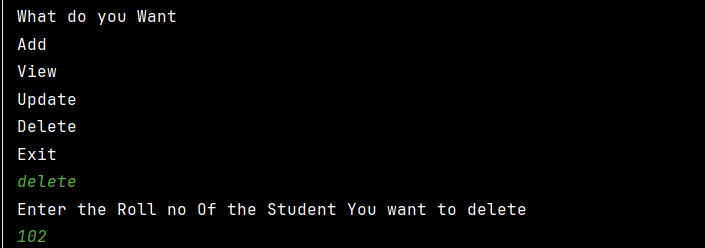

<!DOCTYPE html>
<html>
<head>
    
</head>
<body>

  <h1>Student Record CLI Java Program</h1>

   

        This command-line based Java application lets you manage student records. It supports adding, viewing, updating, and deleting records through console input.
    

  <h2>Features</h2>
    <ul>
        <li>Add new student record</li>
        <li>View all or specific student records</li>
        <li>Update a student's details</li>
        <li>Delete a student record</li>
        <li>Exit the application</li>
    </ul>

  <h2>Technology Used</h2>
    <ul>
        <li>Java</li>
        <li>Scanner for input</li>
        <li>ArrayList to store records</li>
        <li>Console (CLI) based interface</li>
    </ul>

    
  <h2>Sample Output</h2>

  <h3>1. Add Operation</h3>
    
This allows the user to input student details.

    

   <h3>2. View Operation (All Students)</h3>
    
Displays all student records added.

    

  <h3>3. View Operation (Specific Student)</h3>
    
Searches for a student by roll number and displays their record.

    

  <h3>4. Update Operation</h3>
    
Allows user to update name, std, and gender of a student using roll number.

    

  <h3>5. Delete Operation</h3>
    
Deletes a student record by roll number.

    

  <h2>Note</h2>
    

        This is an in-memory application. Records are lost once the program is closed.
    

	<h2>🧑‍💻 Author</h2>
  

    <strong>Swarup Kumar Behera</strong> 
    GitHub: <a href="https://github.com/Swarup121">https://github.com/Swarup121</a>
  

</body>
</html>
